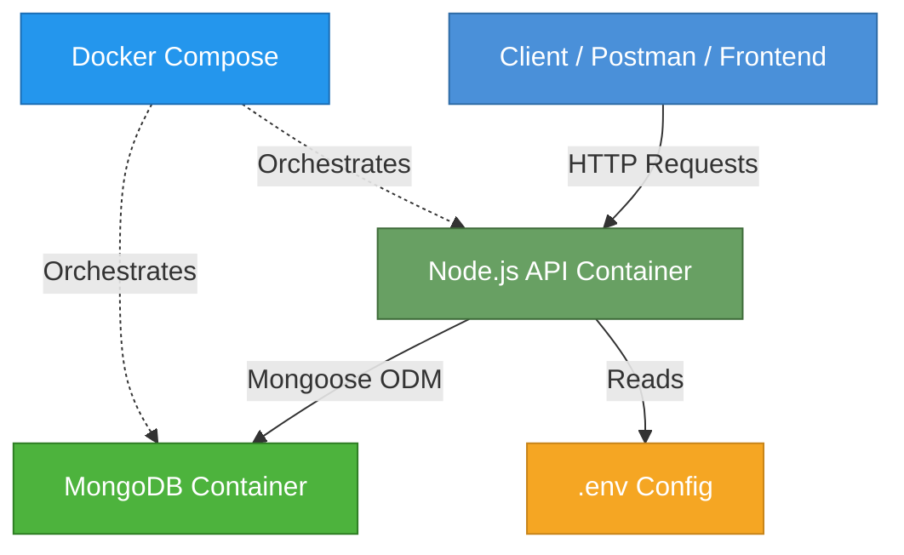

# 📌 PRODUCT REQUIREMENTS DOCUMENT (PRD)

## 1️⃣ Product Overview

| Field            | Detail                                                          |
| ---------------- | --------------------------------------------------------------- |
| **Product Name** | Blogging Platform API                               |
| **Type**         | RESTful Backend Service                                         |
| **Owner**        | Anshul Kumar                                                    |
| **Primary Goal** | Learn production-level API development + Dockerization + industry architecture patterns |

> [!NOTE]
> This project simulates a real microservice used in production to manage blog content. It is designed to reflect best practices in API design, containerization, and scalable architecture.

---

## 2️⃣ Problem Statement

We need a backend service that allows:

- ✅ Creating blog posts
- ✅ Reading blog posts (single & list with pagination)
- ✅ Updating blog posts (full & partial)
- ✅ Deleting blog posts (soft delete)
- ✅ Searching blog posts

The service **must** be:

- 🐳 **Dockerized** — containerized application and database
- 🏗 **Production structured** — follows industry-standard folder layout
- ⚙️ **Environment configurable** — supports `.env`-based configuration
- 🗄 **Database containerized** — MongoDB running in its own container
- 🚀 **Easily deployable** — one-command startup via Docker Compose

---

## 3️⃣ Functional Requirements

### 3.1 Create Blog Post

| Attribute    | Detail               |
| ------------ | --------------------- |
| **Endpoint** | `POST /api/v1/posts` |
| **Auth**     | None (v1)            |

**Request Body:**

```json
{
  "title": "My First Post",
  "content": "This is my blog content",
  "author": "Anshul Kumar",
  "tags": ["nodejs", "docker"]
}
```

**Behavior:**

1. Validate input (title, content, author required; tags optional)
2. Save to MongoDB
3. Return `201 Created` with the created post object

**Validation Rules:**

| Field     | Type       | Required | Constraints              |
| --------- | ---------- | -------- | ------------------------ |
| `title`   | `string`   | ✅ Yes   | Min 3, Max 200 chars     |
| `content` | `string`   | ✅ Yes   | Min 10 chars             |
| `author`  | `string`   | ✅ Yes   | Min 2, Max 100 chars     |
| `tags`    | `string[]` | ❌ No    | Array of strings, max 10 |

**Success Response — `201 Created`:**

```json
{
  "success": true,
  "data": {
    "_id": "64f...",
    "title": "My First Post",
    "content": "This is my blog content",
    "author": "Anshul Kumar",
    "tags": ["nodejs", "docker"],
    "isDeleted": false,
    "createdAt": "2026-02-23T16:30:00.000Z",
    "updatedAt": "2026-02-23T16:30:00.000Z"
  }
}
```

---

### 3.2 Get All Posts

| Attribute    | Detail              |
| ------------ | -------------------- |
| **Endpoint** | `GET /api/v1/posts` |

**Query Parameters:**

| Param    | Type     | Default | Description                          |
| -------- | -------- | ------- | ------------------------------------ |
| `search` | `string` | —       | Search in title and content fields   |
| `page`   | `number` | `1`     | Page number for pagination           |
| `limit`  | `number` | `10`    | Number of posts per page (max `100`) |

**Example Request:**

```
GET /api/v1/posts?search=node&page=1&limit=10
```

**Behavior:**

1. Exclude soft-deleted posts (`isDeleted: false`)
2. Apply search filter (case-insensitive regex on `title` and `content`)
3. Paginate results
4. Return `200 OK` with posts array and pagination metadata

**Success Response — `200 OK`:**

```json
{
  "success": true,
  "count": 2,
  "pagination": {
    "page": 1,
    "limit": 10,
    "totalPages": 1,
    "totalDocs": 2
  },
  "data": [
    {
      "_id": "64f...",
      "title": "My First Post",
      "content": "This is my blog content",
      "author": "Anshul Kumar",
      "tags": ["nodejs", "docker"],
      "createdAt": "2026-02-23T16:30:00.000Z",
      "updatedAt": "2026-02-23T16:30:00.000Z"
    }
  ]
}
```

---

### 3.3 Get Single Post

| Attribute    | Detail                   |
| ------------ | ------------------------- |
| **Endpoint** | `GET /api/v1/posts/:id`  |

**Behavior:**

- Return `200 OK` with the post object if found (and not soft-deleted)
- Return `404 Not Found` if the post does not exist or is soft-deleted

**Error Response — `404 Not Found`:**

```json
{
  "success": false,
  "error": "Post not found"
}
```

---

### 3.4 Update Blog Post (Full)

| Attribute    | Detail                   |
| ------------ | ------------------------- |
| **Endpoint** | `PUT /api/v1/posts/:id`  |

**Behavior:**

1. Replace all mutable fields with provided values
2. Validate the complete request body (same rules as create)
3. Return `200 OK` with the updated post
4. Return `404 Not Found` if post doesn't exist

---

### 3.5 Partial Update Blog Post

| Attribute    | Detail                     |
| ------------ | --------------------------- |
| **Endpoint** | `PATCH /api/v1/posts/:id`  |

**Behavior:**

1. Update **only** the fields provided in the request body
2. Validate only the fields that are present
3. Return `200 OK` with the updated post
4. Return `404 Not Found` if post doesn't exist

---

### 3.6 Delete Blog Post

| Attribute    | Detail                      |
| ------------ | ----------------------------- |
| **Endpoint** | `DELETE /api/v1/posts/:id`  |

**Behavior:**

1. **Soft delete** — set `isDeleted: true` and `deletedAt: Date.now()`
2. Return `204 No Content` (empty body)
3. Return `404 Not Found` if post doesn't exist

> [!IMPORTANT]
> Industry best practice: Use **soft delete** instead of hard delete. This allows data recovery and maintains referential integrity.

---

## 4️⃣ Non-Functional Requirements

| Requirement                | Description                                                       |
| -------------------------- | ----------------------------------------------------------------- |
| **RESTful Design**         | Follows REST conventions — proper verbs, plural nouns, versioning |
| **HTTP Status Codes**      | Correct status codes for every response                           |
| **Centralized Error Handling** | Global error middleware — no scattered try-catch blocks       |
| **Env-Based Config**       | All config values (PORT, DB URI, etc.) loaded from `.env`         |
| **Dockerized**             | Application runs inside a Docker container                        |
| **Docker Compose**         | Multi-container orchestration (API + MongoDB)                     |
| **Logging**                | Structured request/response logging (Morgan + Winston)            |
| **Graceful Shutdown**      | Handle `SIGTERM` / `SIGINT` — close DB connections, drain requests|
| **Scalable Structure**     | Modular folder structure ready for growth                         |

---

## 5️⃣ API Design Best Practices

### Versioning

All endpoints are prefixed with `/api/v1` to support future breaking changes without disrupting existing consumers.

### Status Code Reference

| Code  | Meaning              | Used When                              |
| ----- | -------------------- | -------------------------------------- |
| `200` | OK                   | Successful GET, PUT, PATCH             |
| `201` | Created              | Successful POST (resource created)     |
| `204` | No Content           | Successful DELETE                      |
| `400` | Bad Request          | Validation failure, malformed request  |
| `404` | Not Found            | Resource does not exist                |
| `500` | Internal Server Error| Unexpected server-side errors          |

> [!CAUTION]
> **Never** send stack traces or internal error details in production responses. Use a generic message and log the details server-side.

### Error Response Format

All errors follow a consistent structure:

```json
{
  "success": false,
  "error": "Human-readable error message"
}
```

For validation errors:

```json
{
  "success": false,
  "error": "Validation failed",
  "details": [
    { "field": "title", "message": "Title is required" },
    { "field": "content", "message": "Content must be at least 10 characters" }
  ]
}
```

---

## 6️⃣ System Architecture



### Container Topology

| Service     | Image          | Port Mapping | Volume                  |
| ----------- | -------------- | ------------ | ----------------------- |
| `backend`   | Custom (Dockerfile) | `5000:5000`  | Source code (dev mode) |
| `mongodb`   | `mongo:7`      | `27017:27017`| Named volume for data   |

### Network

Both services communicate on a shared Docker bridge network (`app-network`).

---

## 7️⃣ Data Model

### Post Schema

```javascript
{
  title:     { type: String, required: true, trim: true, minlength: 3, maxlength: 200 },
  content:   { type: String, required: true, minlength: 10 },
  author:    { type: String, required: true, trim: true, minlength: 2, maxlength: 100 },
  tags:      { type: [String], default: [] },
  isDeleted: { type: Boolean, default: false, index: true },
  deletedAt: { type: Date, default: null },
  timestamps: true  // auto createdAt & updatedAt
}
```

### Indexes

| Field                | Type            | Purpose                      |
| -------------------- | --------------- | ---------------------------- |
| `isDeleted`          | Single field    | Fast filtering of active posts |
| `title` (text)       | Text index      | Full-text search             |
| `content` (text)     | Text index      | Full-text search             |
| `createdAt`          | Single field    | Sorting by date              |

---

## 8️⃣ Project Structure

```
blogging-platform-api/
├── src/
│   ├── config/
│   │   └── db.js                  # MongoDB connection logic
│   ├── controllers/
│   │   └── post.controller.js     # Request handlers
│   ├── middlewares/
│   │   ├── error.middleware.js     # Centralized error handler
│   │   └── validate.middleware.js  # Input validation middleware
│   ├── models/
│   │   └── post.model.js          # Mongoose schema & model
│   ├── routes/
│   │   └── post.routes.js         # Express router definitions
│   ├── services/
│   │   └── post.service.js        # Business logic layer (DB operations)
│   ├── utils/
│   │   └── logger.js              # Winston logger setup
│   └── app.js                     # Express app setup
├── server.js                      # Entry point — starts server + graceful shutdown
├── .env                           # Environment variables (git-ignored)
├── .env.example                   # Template for env vars
├── .dockerignore                  # Files to exclude from Docker build
├── Dockerfile                     # Multi-stage Docker build
├── docker-compose.yml             # Service orchestration
├── package.json
└── README.md
```

---

## 9️⃣ Environment Variables

| Variable         | Description                  | Default                                |
| ---------------- | ---------------------------- | -------------------------------------- |
| `NODE_ENV`       | Environment mode             | `development`                          |
| `PORT`           | Server port                  | `5000`                                 |
| `MONGO_URI`      | MongoDB connection string    | `mongodb://mongodb:27017/blogging-platform` |
| `LOG_LEVEL`      | Logging verbosity            | `info`                                 |

---

## 🔟 Deployment & DevOps

### Development Workflow

```bash
# Start all services (API + MongoDB)
docker-compose up --build

# Stop all services
docker-compose down

# Stop and remove volumes (full reset)
docker-compose down -v
```

### Dockerfile Strategy

- **Base image:** `node:20-alpine` (lightweight)
- **Multi-stage build:** Separate dependency install from source copy for faster rebuilds
- **Non-root user:** Run as `node` user for security
- **Health check:** Built-in Docker `HEALTHCHECK` for the API

### Docker Compose Features

- **Depends-on:** Backend waits for MongoDB to be ready
- **Restart policy:** `unless-stopped` for both services
- **Named volumes:** Persistent MongoDB data across container restarts
- **Environment injection:** `.env` file loaded automatically

---

## 📋 Milestone Checklist

| #  | Milestone                              | Status |
| -- | -------------------------------------- | ------ |
| 1  | Project scaffolding & folder structure | ⬜     |
| 2  | Express app setup with middleware      | ⬜     |
| 3  | MongoDB connection with Mongoose       | ⬜     |
| 4  | Post model & validation                | ⬜     |
| 5  | CRUD endpoints implemented             | ⬜     |
| 6  | Search & pagination                    | ⬜     |
| 7  | Centralized error handling             | ⬜     |
| 8  | Logging (Morgan + Winston)             | ⬜     |
| 9  | Graceful shutdown                      | ⬜     |
| 10 | Dockerfile created                     | ⬜     |
| 11 | Docker Compose setup                   | ⬜     |
| 12 | End-to-end testing with Postman        | ⬜     |
| 13 | README documentation                   | ⬜     |

---

> [!TIP]
> **Next Step:** Once this PRD is approved, we'll scaffold the project and start implementing milestone by milestone, following the architecture defined above.
