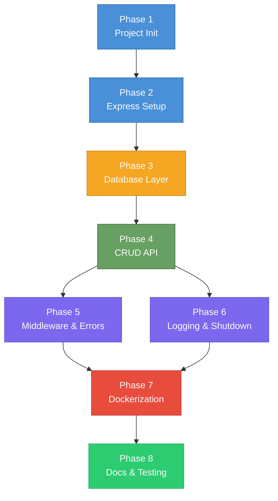

# 📋 PROJECT TASK BREAKDOWN

> **Project:** Blogging Platform API
> **Total Tasks:** 8 Phases · 30+ Sub-tasks
> **Approach:** Each task is a self-contained deliverable — build, test, commit.

---

## Phase 1️⃣ — Project Initialization & Setup

**Goal:** Scaffold the project with production-grade structure and configuration.

| #   | Task                                      | Priority | Status |
| --- | ----------------------------------------- | -------- | ------ |
| 1.1 | Initialize Node.js project (`npm init`)   | 🔴 High  | ⬜     |
| 1.2 | Install core dependencies (express, mongoose, dotenv, cors, morgan, winston) | 🔴 High | ⬜ |
| 1.3 | Install dev dependencies (nodemon)        | 🟡 Med   | ⬜     |
| 1.4 | Create folder structure (`src/config`, `src/controllers`, `src/models`, `src/routes`, `src/middlewares`, `src/services`, `src/utils`) | 🔴 High | ⬜ |
| 1.5 | Create `.env` and `.env.example` files     | 🔴 High  | ⬜     |
| 1.6 | Create `.gitignore`                        | 🟡 Med   | ⬜     |
| 1.7 | Add `npm scripts` (`start`, `dev`)         | 🔴 High  | ⬜     |

**Deliverable:** Running `npm run dev` starts the server (without DB yet).

---

## Phase 2️⃣ — Express App Setup

**Goal:** Configure the Express application with all middleware.

| #   | Task                                           | Priority | Status |
| --- | ---------------------------------------------- | -------- | ------ |
| 2.1 | Create `src/app.js` — Initialize Express app   | 🔴 High  | ⬜     |
| 2.2 | Add middleware: `express.json()`, `cors`, `morgan` | 🔴 High | ⬜  |
| 2.3 | Create `server.js` — Entry point with port binding | 🔴 High | ⬜  |
| 2.4 | Add health check route (`GET /health`)          | 🟡 Med   | ⬜     |
| 2.5 | Test: Server starts and responds on `/health`   | 🔴 High  | ⬜     |

**Deliverable:** `GET http://localhost:5000/health` returns `{ status: "ok" }`.

---

## Phase 3️⃣ — Database Layer

**Goal:** Connect to MongoDB and define the data model.

| #   | Task                                          | Priority | Status |
| --- | --------------------------------------------- | -------- | ------ |
| 3.1 | Create `src/config/db.js` — MongoDB connection with Mongoose | 🔴 High | ⬜ |
| 3.2 | Add connection event logging (connected, error, disconnected) | 🟡 Med | ⬜ |
| 3.3 | Create `src/models/post.model.js` — Post schema with validation | 🔴 High | ⬜ |
| 3.4 | Add text indexes on `title` + `content`       | 🟡 Med   | ⬜     |
| 3.5 | Call `connectDB()` from `server.js`            | 🔴 High  | ⬜     |
| 3.6 | Test: Server connects to MongoDB successfully  | 🔴 High  | ⬜     |

**Deliverable:** Server starts and logs `MongoDB Connected: <host>`.

---

## Phase 4️⃣ — Core CRUD API

**Goal:** Implement all blog post endpoints following the service-layer pattern.

| #   | Task                                          | Priority | Status |
| --- | --------------------------------------------- | -------- | ------ |
| 4.1 | Create `src/utils/ApiError.js` — Custom error class | 🔴 High | ⬜ |
| 4.2 | Create `src/services/post.service.js` — Business logic layer | 🔴 High | ⬜ |
| 4.3 | Create `src/controllers/post.controller.js` — Request handlers | 🔴 High | ⬜ |
| 4.4 | Create `src/routes/post.routes.js` — Route definitions | 🔴 High | ⬜ |
| 4.5 | Mount routes in `app.js` at `/api/v1/posts`   | 🔴 High  | ⬜     |

### Endpoints to Implement

| Method   | Endpoint              | Service Method     | Status |
| -------- | --------------------- | ------------------ | ------ |
| `POST`   | `/api/v1/posts`       | `createPost()`     | ⬜     |
| `GET`    | `/api/v1/posts`       | `getAllPosts()`     | ⬜     |
| `GET`    | `/api/v1/posts/:id`   | `getPostById()`    | ⬜     |
| `PUT`    | `/api/v1/posts/:id`   | `updatePost()`     | ⬜     |
| `PATCH`  | `/api/v1/posts/:id`   | `partialUpdate()`  | ⬜     |
| `DELETE` | `/api/v1/posts/:id`   | `deletePost()`     | ⬜     |

**Deliverable:** All 6 endpoints working and tested via Postman / cURL.

---

## Phase 5️⃣ — Middleware & Error Handling

**Goal:** Add validation, centralized error handling, and search/pagination.

| #   | Task                                          | Priority | Status |
| --- | --------------------------------------------- | -------- | ------ |
| 5.1 | Create `src/middlewares/validate.middleware.js` — Input validation | 🔴 High | ⬜ |
| 5.2 | Create `src/middlewares/error.middleware.js` — Global error handler | 🔴 High | ⬜ |
| 5.3 | Attach validation middleware to POST/PUT/PATCH routes | 🔴 High | ⬜ |
| 5.4 | Implement search (query on title + content)    | 🟡 Med   | ⬜     |
| 5.5 | Implement pagination (`page`, `limit`, metadata) | 🟡 Med  | ⬜     |
| 5.6 | Handle 404 for unknown routes                  | 🟡 Med   | ⬜     |
| 5.7 | Suppress stack traces in production mode       | 🟡 Med   | ⬜     |

**Deliverable:** Invalid requests return structured errors; search & pagination work.

---

## Phase 6️⃣ — Logging & Graceful Shutdown

**Goal:** Add production-grade logging and safe server shutdown.

| #   | Task                                          | Priority | Status |
| --- | --------------------------------------------- | -------- | ------ |
| 6.1 | Create `src/utils/logger.js` — Winston logger setup | 🟡 Med | ⬜  |
| 6.2 | Replace `console.log` with Winston logger      | 🟡 Med   | ⬜     |
| 6.3 | Add `SIGTERM` / `SIGINT` handlers in `server.js` | 🟡 Med  | ⬜     |
| 6.4 | Close DB connection on shutdown                 | 🟡 Med   | ⬜     |
| 6.5 | Test: Kill process → logs clean shutdown        | 🟡 Med   | ⬜     |

**Deliverable:** Structured logs to console/file; graceful shutdown on `Ctrl+C`.

---

## Phase 7️⃣ — Dockerization

**Goal:** Containerize the application and orchestrate with Docker Compose.

| #   | Task                                          | Priority | Status |
| --- | --------------------------------------------- | -------- | ------ |
| 7.1 | Create `.dockerignore`                         | 🟡 Med   | ⬜     |
| 7.2 | Create `Dockerfile` (Node Alpine, layer caching, non-root user) | 🔴 High | ⬜ |
| 7.3 | Create `docker-compose.yml` (backend + mongodb services) | 🔴 High | ⬜ |
| 7.4 | Configure named volume for MongoDB persistence | 🟡 Med   | ⬜     |
| 7.5 | Configure environment variables via `.env`     | 🔴 High  | ⬜     |
| 7.6 | Test: `docker-compose up --build` — API + DB start | 🔴 High | ⬜  |
| 7.7 | Test: All CRUD endpoints work inside containers | 🔴 High | ⬜    |
| 7.8 | Test: Data persists after `docker-compose down` + `up` | 🟡 Med | ⬜ |

**Deliverable:** `docker-compose up --build` spins up entire stack in one command.

---

## Phase 8️⃣ — Documentation & Final Testing

**Goal:** Document the project and perform end-to-end validation.

| #   | Task                                          | Priority | Status |
| --- | --------------------------------------------- | -------- | ------ |
| 8.1 | Write `README.md` — Setup, API docs, commands  | 🔴 High  | ⬜     |
| 8.2 | Create Postman collection (all endpoints)       | 🟡 Med   | ⬜     |
| 8.3 | Full E2E test — fresh `docker-compose up`, test all endpoints | 🔴 High | ⬜ |
| 8.4 | Code review & cleanup                           | 🟡 Med   | ⬜     |

**Deliverable:** Someone can clone the repo, run `docker-compose up`, and the API works.

---

## 📈 Phase Dependency Map

> [!TIP]
> **Recommended workflow:** Complete each phase fully before moving to the next. Commit after each phase with a meaningful message like `feat: add CRUD endpoints` or `chore: dockerize application`.
