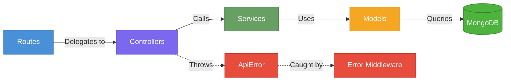
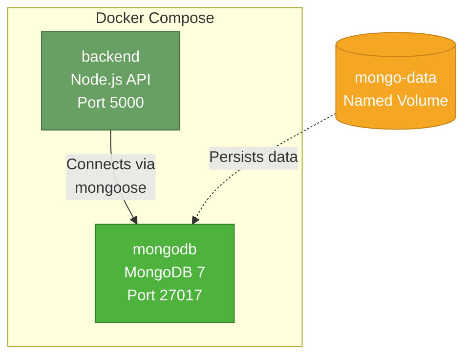

# 🛠 TECH STACK DOCUMENT (Industry Oriented)

> **Project:** Blogging Platform API
> **Owner:** Anshul Kumar
> **Stack Philosophy:** MERN-aligned, production-grade, Docker-first

---

## 1️⃣ Backend Stack

| Technology       | Version / Variant | Role                          |
| ---------------- | ----------------- | ----------------------------- |
| **Node.js**      | LTS (v20.x)       | Runtime environment           |
| **Express.js**   | v4.x              | Web framework & routing       |
| **MongoDB**      | v7.x              | NoSQL document database       |
| **Mongoose**     | v8.x              | MongoDB ODM — schema, queries |

### Why This Stack?

- ✅ **Career alignment** — Strengthens MERN expertise for full-stack roles
- ✅ **Industry prevalence** — Node + Express + Mongo is one of the most widely used backend combos in startups and scale-ups
- ✅ **JSON-native** — MongoDB documents map 1:1 with API request/response bodies
- ✅ **Non-blocking I/O** — Node's event loop handles concurrent API requests efficiently
- ✅ **Rich ecosystem** — Massive npm library support for validation, logging, auth, etc.

---

## 2️⃣ Project Architecture (Production-Level)

> [!NOTE]
> This structure mirrors real company codebases — each concern has a dedicated layer, making the codebase scalable, testable, and easy to onboard new developers.

```
blogging-platform-api/
│
├── src/
│   ├── config/
│   │   └── db.js                  # MongoDB connection logic
│   │
│   ├── controllers/
│   │   └── post.controller.js     # Request handling — parse, respond
│   │
│   ├── models/
│   │   └── post.model.js          # Mongoose schema & model definition
│   │
│   ├── routes/
│   │   └── post.routes.js         # Route definitions & HTTP verb mapping
│   │
│   ├── middlewares/
│   │   ├── error.middleware.js     # Centralized error handler
│   │   └── validate.middleware.js  # Input validation middleware
│   │
│   ├── services/
│   │   └── post.service.js        # Business logic layer (DB operations)
│   │
│   ├── utils/
│   │   └── ApiError.js            # Custom error class with status codes
│   │
│   └── app.js                     # Express app assembly (middleware + routes)
│
├── server.js                      # Entry point — starts server + graceful shutdown
├── Dockerfile                     # Container build instructions
├── docker-compose.yml             # Multi-container orchestration
├── .env                           # Environment variables (git-ignored)
├── .dockerignore                  # Files excluded from Docker context
└── package.json                   # Dependencies & scripts
```

### Layer Responsibilities



| Layer            | Responsibility                                              |
| ---------------- | ----------------------------------------------------------- |
| **Routes**       | Define endpoints, attach middleware, delegate to controllers |
| **Controllers**  | Parse request, call service, send response                  |
| **Services**     | Business logic & database operations (Mongoose queries)     |
| **Models**       | Schema definition, validation rules, indexes                |
| **Middlewares**  | Cross-cutting concerns (validation, error handling)         |
| **Utils**        | Shared helpers (custom errors, logger, etc.)                |

> [!IMPORTANT]
> **Controllers should NOT contain database queries directly.** All DB logic lives in the **service layer**. This separation makes the code testable and swappable.

---

## 3️⃣ Database Schema

### Post Schema

| Field        | Type       | Required | Default   | Notes                      |
| ------------ | ---------- | -------- | --------- | -------------------------- |
| `title`      | `String`   | ✅ Yes   | —         | Trimmed, 3–200 chars       |
| `content`    | `String`   | ✅ Yes   | —         | Min 10 chars               |
| `author`     | `String`   | ✅ Yes   | —         | Trimmed, 2–100 chars       |
| `tags`       | `[String]` | ❌ No    | `[]`      | Array of tag strings       |
| `isDeleted`  | `Boolean`  | ❌ No    | `false`   | Soft delete flag           |
| `deletedAt`  | `Date`     | ❌ No    | `null`    | Timestamp of soft deletion |
| `createdAt`  | `Date`     | Auto     | —         | Mongoose `timestamps`      |
| `updatedAt`  | `Date`     | Auto     | —         | Mongoose `timestamps`      |

### Indexes

| Index                          | Type         | Purpose                        |
| ------------------------------ | ------------ | ------------------------------ |
| `{ title: "text", content: "text" }` | Text index   | Full-text search on posts |
| `{ createdAt: -1 }`           | Single field | Fast sorting by newest first   |
| `{ isDeleted: 1 }`            | Single field | Quick filtering of active posts|

---

## 🐳 Docker Implementation Strategy (Industry Level)

### Why Docker?

In real companies, Docker solves these critical problems:

| Problem                          | Docker Solution                          |
| -------------------------------- | ---------------------------------------- |
| "Works on my machine" syndrome   | Identical environments everywhere        |
| Complex dev setup / onboarding   | One command: `docker-compose up`         |
| Environment inconsistencies      | Containerized dependencies               |
| CI/CD pipeline complexity        | Build once, run anywhere                 |
| Future scaling needs             | Container → Kubernetes migration path    |

---

### Dockerfile (Backend)

**Responsibilities:**

1. Use official Node.js Alpine image (lightweight ~50MB)
2. Set working directory (`/app`)
3. Install production dependencies
4. Copy source code
5. Expose port `5000`
6. Start the application

**Best Practices Applied:**

| Practice                | Why                                              |
| ----------------------- | ------------------------------------------------ |
| `.dockerignore`         | Exclude `node_modules`, `.git`, `.env` from build context |
| Layer caching           | Copy `package*.json` first, install deps, then copy source |
| Non-root user           | Run as `node` user for security                  |
| Alpine base image       | Minimal footprint, fewer vulnerabilities         |
| Multi-stage build *(advanced)* | Separate build and runtime stages       |

**Dockerfile Blueprint:**

```dockerfile
# ---- Base Stage ----
FROM node:20-alpine

WORKDIR /app

# Install dependencies (cached layer)
COPY package*.json ./
RUN npm ci --only=production

# Copy source code
COPY . .

# Run as non-root
USER node

EXPOSE 5000

CMD ["node", "server.js"]
```

---

### docker-compose.yml

**Services Overview:**



| Service      | Image / Build     | Ports          | Depends On | Volumes               |
| ------------ | ----------------- | -------------- | ---------- | ---------------------- |
| **backend**  | Build from `./Dockerfile` | `5000:5000`    | `mongodb`  | Source code (dev mode) |
| **mongodb**  | `mongo:7`         | `27017:27017`  | —          | `mongo-data` (named)   |

---

### Environment Variables

```env
PORT=5000
MONGO_URI=mongodb://mongodb:27017/blogging-platform
NODE_ENV=development
```

> [!IMPORTANT]
> **`mongodb` in the connection string is the Docker Compose service name, NOT `localhost`.** Docker's internal DNS resolves service names to container IPs automatically. This is how containers communicate on the shared bridge network.

---

### Docker Commands Reference

| Command                          | Purpose                              |
| -------------------------------- | ------------------------------------ |
| `docker-compose up --build`      | Build images & start all services    |
| `docker-compose up -d`           | Start in detached (background) mode  |
| `docker-compose down`            | Stop and remove containers           |
| `docker-compose down -v`         | Stop, remove containers AND volumes  |
| `docker-compose logs -f backend` | Stream backend logs in real-time     |
| `docker exec -it <id> sh`        | Shell into a running container       |

---

> [!TIP]
> **Next Step:** With the tech stack defined, we can begin scaffolding the project structure and implementing the API milestone by milestone.
